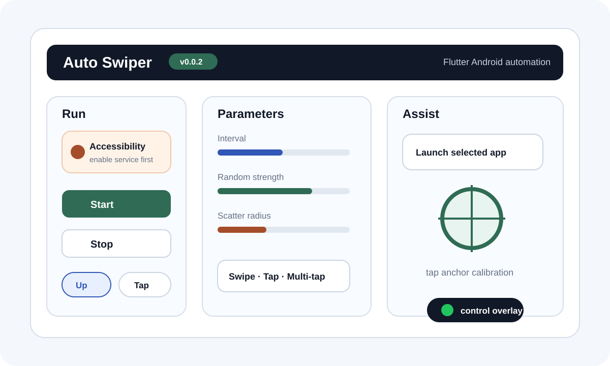
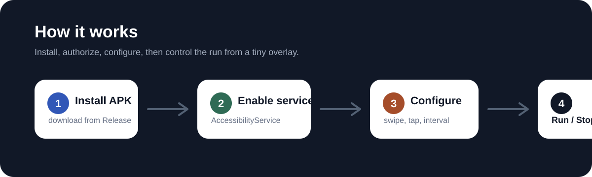

# Auto Swiper

Auto Swiper 是一个 Flutter Android 自动滑屏工具。它通过 Android
`AccessibilityService` 在用户主动授权后执行随机滑动、点击和连点手势，适合个人自动化、界面测试、稳定性观察和学习研究使用。

> 请负责任地使用本项目。不要用它刷量、作弊、绕过第三方平台规则，或执行任何违反法律法规、平台条款和他人权益的行为。



## 功能

- 随机上滑或下滑。
- 随机点击和随机连点。
- 可配置动作间隔、随机强度、散点半径、连点次数和连点间隔。
- 支持“开始后回到上一个应用”或“开始后打开指定 App”。
- 运行时显示无障碍小窗，可返回主界面或停止动作。
- 可显示点击标靶，方便校准点击位置。
- 可开启调试日志，便于排查无障碍服务和手势派发问题。
- 手机竖屏和 Pad/宽屏横屏都有独立控制台布局。

## 系统要求

- Android 7.0 或更新版本。
- 需要用户手动开启本应用的无障碍服务。
- 部分厂商系统可能需要允许后台运行、关闭电池优化或加入白名单。

## 安装

### 下载 APK

从 GitHub Releases 下载最新版 APK，然后在 Android 设备上安装。

如果系统提示“不允许安装未知来源应用”，请在系统设置中允许当前安装器安装 APK。

### 自行构建

需要先安装 Flutter SDK 和 Android 构建环境。

```powershell
flutter pub get
flutter analyze
flutter test
flutter build apk --release
```

默认 release APK 输出位置：

```text
build/app/outputs/flutter-apk/app-release.apk
```

如需按 ABI 拆分包体：

```powershell
flutter build apk --release --split-per-abi
```

## 使用方法

1. 打开“随机滑屏”。
2. 点击“打开无障碍设置”。
3. 在系统无障碍页面中启用“随机滑屏”服务。
4. 返回应用，选择动作类型：滑动、点击或连点。
5. 根据需要调整间隔、方向、随机强度、散点半径等参数。
6. 选择启动策略：
   - “上一个 App”：开始后自动退回上一个应用。
   - “指定 App”：开始后自动打开你选择的目标应用。
7. 点击“开始随机动作”。
8. 运行中可通过屏幕上的小窗返回主界面或停止动作。



## 常见问题

### 为什么开始按钮不可用？

通常是因为无障碍服务还没有开启。请先进入系统无障碍设置，启用“随机滑屏”。

### 为什么运行一段时间后停止了？

一些 Android 系统会限制后台进程或无障碍服务。可以尝试：

- 关闭本应用的电池优化。
- 允许后台运行。
- 避免在系统任务管理器中强行停止应用。
- 重新打开无障碍服务。

### 为什么指定 App 列表里没有某个应用？

列表只显示带启动入口的应用。如果目标应用没有标准 launcher 入口，系统可能不会返回它。

### 点击标靶有什么用？

点击和连点模式会围绕标靶位置做随机散点。你可以先显示标靶，把它拖到目标区域，再开始动作。

### 调试日志在哪里？

在应用内打开调试日志后，界面会显示日志路径。你可以复制路径后通过 adb 或文件管理工具查看。

## 隐私与权限

本项目不包含网络请求，也不会主动上传数据。

应用使用 `AccessibilityService` 的目的，是在用户主动开启服务后派发滑动和点击手势。无障碍权限能力较强，请只安装你信任的版本，并在不需要时关闭该服务。

## 版本规则

当前版本从 `0.0.1` 开始。

- 正常功能版本按前三位递增，例如 `0.0.2`、`0.1.0`。
- 仅修复类版本可从第四位递增，例如 `0.0.2.1`。

## 开发

常用验证命令：

```powershell
flutter analyze
flutter test
flutter build apk --debug
```

调试 APK 输出位置：

```text
build/app/outputs/flutter-apk/app-debug.apk
```

主要目录：

- `lib/`：Flutter 控制台界面和 MethodChannel 调用。
- `android/app/src/main/kotlin/com/codex/autoswiper/`：Android 无障碍服务、手势生成、状态存储和日志。
- `android/app/src/main/res/`：Android 资源、文案和无障碍服务配置。
- `test/`：Flutter widget 测试。

## 贡献

欢迎提交 Issue 和 Pull Request。提交前建议先运行：

```powershell
flutter analyze
flutter test
```

涉及 Android 原生服务、Manifest 或资源时，请补充：

```powershell
flutter build apk --debug
```

## 许可证

本项目使用 MIT License，详见 [LICENSE](LICENSE)。
